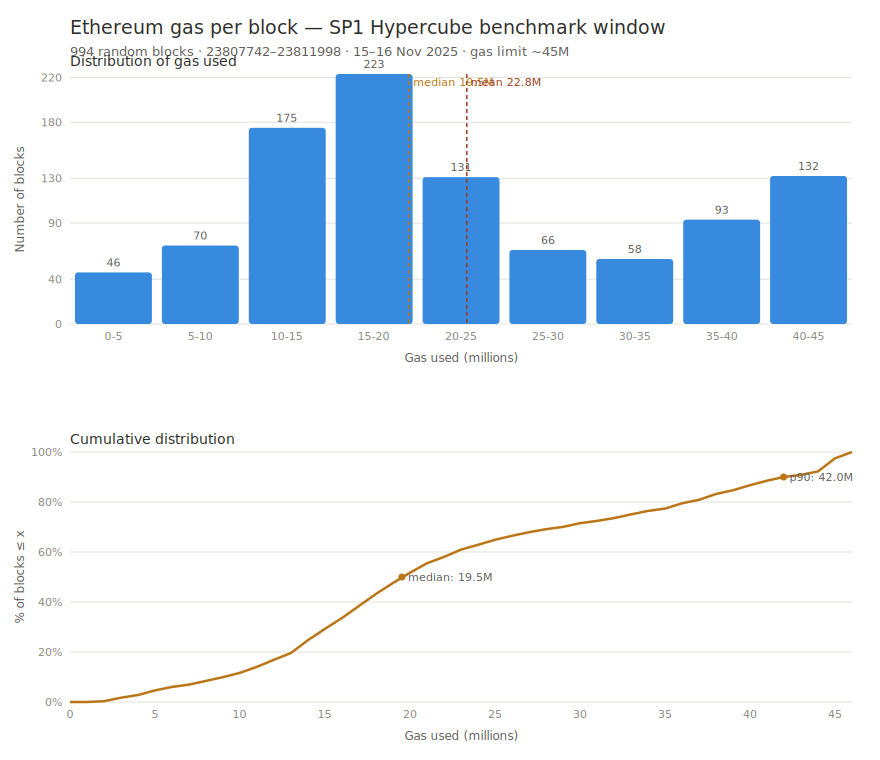

# Gas distribution — SP1 Hypercube benchmark window

Summary of `block-gas.csv` (994 blocks), sampled randomly over the **exact range of the Succinct
benchmark** (`23807742–23811998`, Nov 15–16, 2025, ~14 h). Data: `eth_getBlockByNumber` via
`scripts/pull-block-gas.py`. Graph: `gas-distribution.svg` (regenerable via `scripts/plot-gas.py`).



## Provenance

| | |
|---|---|
| Blocks | **994** (of 1000; 6 failed fetches) |
| Range | `23807742`–`23811998` (span 4256 blocks) |
| Dates | 2025-11-15 23:03 → 2025-11-16 13:18 UTC |
| Gas limit | ~**45M** (post-Pectra, pre-Fusaka; 60M today) |

## Gas distribution (millions)

| stat | gas | stat | gas |
|---|---:|---|---:|
| min | 1.37 | median | **19.53** |
| p10 | 9.07 | mean | **22.83** |
| p25 | 14.05 | p90 | 41.97 |
| p75 | 32.97 | p95 | 44.88 |
| | | p99 | 45.08 |
| | | max | 45.26 |

Standard deviation **12.0M** (CV ~52%). **mean > median** → **right-skewed** distribution,
pulled by a tail of near-full blocks.

## Fill rate (% of gas limit)

Mean **50.7%** · median **43.4%** — a **loaded** window (near the 50% target), not light blocks.

| band | blocks | share |
|---|---:|---:|
| 0-9% near-empty | 4 | 0.4% |
| 10-24% light | 145 | 14.6% |
| **25-49% moderate** | **448** | **45.1%** |
| 50-74% filled | 160 | 16.1% |
| **75-100% near-full** | **237** | **23.8%** |

## Histogram (gas, M)

```
 0- 5M  ###  4.6%
 5-10M  ####  7.0%
10-15M  ###########  17.6%   ┐
15-20M  #############  22.4%  ├ central peak 10-25M (53%)
20-25M  ########  13.2%       ┘
25-30M  ####  6.6%
30-35M  ####  5.8%
35-40M  ######  9.4%
40-46M  ########  13.3%   ← 2nd bump: 132 near-full blocks
```
**Bimodal**: a large cluster at 10-25M + a bump of full blocks at 40-45M.

## Transactions

Median **162**, mean **170**, p90 **247**, p99 **383**, max **627**. Correlation **gas↔tx = 0.53**
(moderate) → gas depends as much on content (calldata/compute) as on the number of txs.

## Takeaways

1. **Honest reference**: this is the distribution over which Succinct's "99.7% <12s" is measured.
   ~50% average fill, 24% near-full blocks — not cherry-picked light.
2. **Median ~19.5M** (≈ typical block), but a **heavy tail** (p90 42M, up to full at 45M).
3. **For cycles** (upcoming): same shape expected — moderate core + heavy tail. Since
   `cyc/gas` varies from 6 to 25× (`report.csv`), this gas tail + the compute-heavy blocks will form the
   proving-time tail (the ~0.3% that miss the 12s).
4. **Cap of 45M (then) vs 60M (today)**: replayed on current mainnet, full blocks
   would be ~33% heavier.
