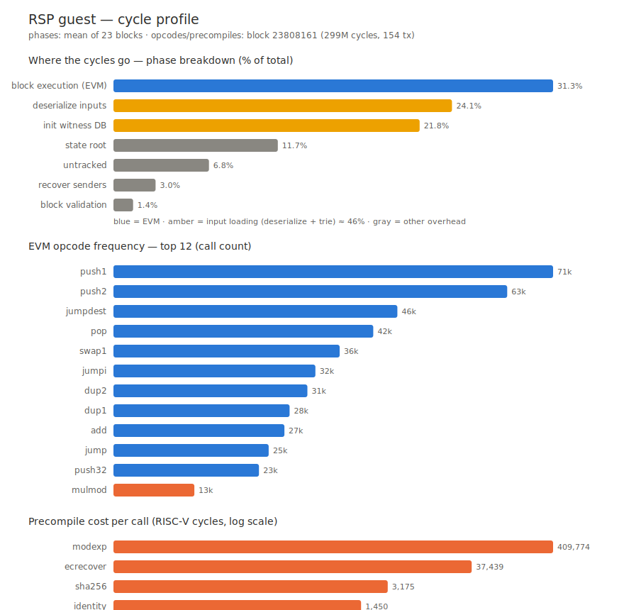

# RSP guest profile (cycles)

Profiling of the guest program (RSP/SP1, stateless execution of an Ethereum block). Sources:
- **Phases**: `rsp/report.csv` (cycle-tracker, average over 23 blocks).
- **EVM opcodes + precompiles**: `rsp --opcode-tracking --precompile-tracking` run on block 23808161
  (cached, 299M clean cycles, 154 txs).

## Phases (% of cycles, average over 23 blocks)

| phase | % cycles | category |
|---|---:|---|
| **block execution (EVM)** | 31.3% | EVM |
| **deserialize inputs** | 24.1% | input loading |
| **init witness DB** | 21.8% | input loading |
| state root | 11.7% | overhead (MPT hash) |
| untracked | 6.8% | glue |
| recover senders | 3.0% | overhead (ecrecover) |
| block validation | 1.4% | overhead |

→ **input loading (deserialize + trie) ≈ 46%**, actual EVM **31%**, total overhead ≈ **56%**.

## EVM opcodes — frequency (block 23808161, 741k opcodes)

| opcode | calls | opcode | calls |
|---|---:|---|---:|
| push1 | 70 586 | dup1 | 28 277 |
| push2 | 63 217 | add | 27 452 |
| jumpdest | 45 588 | jump | 24 916 |
| pop | 41 719 | push32 | 23 357 |
| swap1 | 36 322 | **mulmod** | 12 994 |
| jumpi | 32 428 | | |
| dup2 | 31 140 | | |

→ **stack/control plumbing** (push/pop/dup/swap/jump/jumpdest). The only notable computation: `mulmod` (crypto).
Actual cost ≈ **~125 RISC-V cycles / EVM opcode** (revm-in-the-zkVM interpreter tax; derived: ~93M
block-exec cycles ÷ 741k opcodes).

## Precompiles — cost per call (reliable)

| precompile | cyc/call | calls (this block) |
|---|---:|---:|
| **modexp** | ~409 800 | 6 |
| **ecrecover** | ~37 400 | 13 |
| sha256 | ~3 200 | 4 |
| identity | ~1 450 | 3 |

→ **modexp is the behemoth** (~410k cyc/call), then ecrecover (~37k).

## Takeaways

1. The guest is **memory/address-bound** (at the RISC-V level: ~38% load/store, mul/div 0.4%) — the cost
   is in **shuffling the witness** (bincode deserialize + MPT trie construction), not computation.
2. The **actual EVM is only ~31%**, and it is mostly the **interpreter tax** (~125 cyc/opcode × many
   stack opcodes).
3. Cycle-reduction levers: **witness format (zero-copy) + deserialization** (~46%), and a
   cheaper-per-opcode EVM / MPT precompiles. Exactly the axes where OpenVM/ZisK diverge.

## SP1 gas cost (PGU) per syscall

Official table `sp1-core-executor-6.2.4/src/artifacts/rv64im_costs.json` (trace cost weight per
event; non-`User` variants = trusted, the RSP case). `prover_gas = (3·trace_area + complexity) / 191`.

| chip / syscall | PGU | × `add` (33) |
|---|---:|---:|
| KeccakPermute | 2 640 | 80× |
| Bls12381 add/double | ~2 400 | 73× |
| Secp256k1 / Bn254 add | 1 599 | 48× |
| Secp256k1 / Bn254 double | 1 591 | 48× |
| EdAddAssign | 1 347 | 41× |
| Bn254 Fp2 mul | 1 095 | 33× |
| Uint256Ops | 477 | 14× |
| Uint256MulMod (modexp) | 371 | 11× |
| Poseidon2 | 348 | 11× |
| ShaCompress / Extend | 206 / 128 | 6× / 4× |
| Mul | 82 | 2.5× |
| Bitwise / Shift | 51 / ~69 | ~1.7× |
| Branch / Load / Store | 45 / 44 / 39 | ~1.3× |
| Add / Sub (ref) | 33 | 1× |
| Range | 3 | 0.1× |

(+ ~75 PGU of dispatch per syscall: `SyscallInstrs` 65 + `SyscallPrecompile` 10.)

→ **SP1 gas (PGU)** weights by the true proving cost: a keccak costs **80×** an add (≈1 ECALL in
cycles, but 80× in gas). Block 23808161: `prover_gas` 362M ≈ ×1.21 cycles, with the premium driven by keccak
(57k ×2640) + secp256k1 (128k ×1600) → crypto syscalls dominate the gas.

## ⚠️ Methodology caveat

`--opcode-tracking` instruments **every** EVM opcode (one cycle-tracker span per opcode) → adds
~940 cyc of overhead per opcode. Verified: the *tracked* opcode aggregate = 858M ≫ 299M clean total. So
the **counts/frequencies are reliable**, but the **absolute cycles/opcode are inflated ~3×** — hence the
**derived** actual cost (~125 cyc) rather than measured. The **precompiles stay reliable** (cost/call ≫ overhead).
